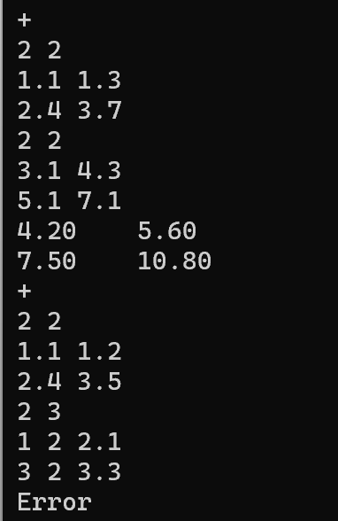

# algebra for JauntyJinn

硬件技术团队编程基础作业1

## 题目要求

#### 输入格式

本题目采用帧判定的思路进行，每一帧的第一行指令代码，`+`、`-`、`*`、`.`、`t`、`d`、`i`、`r`、`j`分别测试`add_matrix`、`sub_matrix`、`mul_matrix`、`scale_matrix`、`transpose_matrix`、`det_matrix`、`inv_matrix`、`rank_matrix`、`trace_matrix`函数，`q`表示退出。

接下来的一行输入矩阵 $\mathbf{A}$ 的行数 $m$ 和列数 $n$ ，在接下来的 $m$ 行中输入 $n$ 个双精度浮点数，以空格分开。
对于二元运算函数的测试，需要再按照上述过程输入矩阵 $\textbf{B}$ 。

可能的一次运行输入如下：
```
+
2 2
1.1 1.3
2.4 3.7
2 2
3.1 4.3
5.1 7.1
+
2 2
1.1 1.2
2.4 3.5
2 3
1 2 2.1
3 2 3.3
q
```
#### 输出格式

在每一帧中，依次根据输入的指令代码运行对应的函数，并给出函数的输出与标准值比对。上述输入的正确输出如下：
```
4.20    5.60    
7.50    10.80
Error: Matrix a and b must have the same rows and cols.
```
## 宝盖的实现

- 加法

  

- 减法


- 叉乘

  

- 数乘

  

- 转置矩阵

  

- 行列式

  

- 求逆

  

- 秩

  

- 迹

  

## 宝盖的repo

#### about程序本身

- 思路：

  - **`det_matrix(Matrix a)`**计算方阵的行列式。

    - 递归：0x0 矩阵行列式为 1，1x1 矩阵行列式为其唯一元素。创建子矩阵 `submatrix`（移除第 0 行和第 `j` 列）。递归调用 `det_matrix(submatrix)` 计算子行列式 `sub_det`。根据公式 `det += (-1)^(0+j) * a.data[0][j] * sub_det` 累加结果。
    - 先检查矩阵是否为方阵；再递归。

  - **`inv_matrix(Matrix a)`**计算方阵的逆矩阵。

    - 先计算行列式是否接近零，如果接近零，矩阵奇异，不可逆，返回 0x0 矩阵。
    - 创建伴随矩阵 `adjugate`，维度与 `a` 相同。遍历 `adjugate` 的每个位置 `(i, j)`。计算代数余子式 `C_ji = (-1)^(j+i) * det(A_ji)`，其中 `A_ji` 是 `a` 移除第 `j` 行和第 `i` 列得到的子矩阵（注意下标 `j, i`）。使用 `create_submatrix` 和 `det_matrix`。将 `C_ji` 赋值给 `adjugate.data[i][j]`。使用 `scale_matrix` 将伴随矩阵 `adjugate` 乘以 `1.0 / det`，得到逆矩阵 `inverse`。返回逆矩阵 `inverse`。

  - **`rank_matrix(Matrix a)`**计算矩阵的秩。

    在当前列 `j` 的 `pivot_row` 行及下方，找到绝对值最大的元素所在行 `max_row`（列主元法，提高数值稳定性）。如果 `max_row` 行的第 `j` 列元素绝对值接近零，说明此列在 `pivot_row` 下方没有主元，跳到下一列。使用 `swap_rows` 将 `max_row` 行与 `pivot_row` 行交换。对于 `pivot_row` 下方的每一行 `i`，计算因子 `factor = temp_matrix.data[i][j] / temp_matrix.data[pivot_row][j]`，然后用行操作 `R_i = R_i - factor * R_pivot` 将第 `i` 行的第 `j` 列元素变为零（为了避免精度误差，代码直接将其设为 0.0，并对后续列执行减法操作）。将 `pivot_row` 加 1，`rank` 加 1。返回最终的秩 `rank`。

- 最后的求逆，秩，借鉴了copilot的成果（）

- 过程中遇到的一个问题，`m->data[r1] = m->data[r2];`会报错，非常奇怪。经过对copilot的层层逼问，发现问题所在，醍醐灌顶：

> **问题原因：** 你用的是**静态二维数组**作为矩阵存储（`double data[MAX_MATRIX_SIZE][MAX_MATRIX_SIZE];`），而不是指针数组（`double **data;`）。
> 这样定义后，`data` 不是指针数组，不能像指针数组那样交换行指针（`m->data[r1] = m->data[r2];`），所以会报“表达式必须是可修改的左值”。
>
> **解决方法：**继续用静态数组，不要用 swap_rows 交换指针

#### about环境配置

- 还是非常有自豪感的！

- 上学期已经把MinGW编辑进环境变量，当时路径名有中文，所以现在编译失败。于是移动 MinGW 到无空格和无中文的路径，添加环境变量，重新配置cmake。但是任然显示失败。在这里卡了很久。

  解决方法：手动删除整个 build 目录；重启vscode（会有提示，是不是要更改cmake配置）；再依次输入：

  ```
  mkdir build
  cd build
  cmake -G "MinGW Makefiles" ..
  cmake --build .
  ```

  就好啦！但有一个问题，我好像只能通过输入`cmake --build .`来生成，不能通过vscode左下角的“生成”键来生成。

- 只要一直拷问copilot就好啦，假如一个模型开始抽风就换一个模型继续问。
